# Phala Cloud User Guide

## 📌 Get Started - Play with Template

**Step1- Deploy a CVM with Template**

Click the **Deploy** button in the top-right corner of the cloud [homepage](https://cloud.phala.network/) to access the deployment dashboard. Once there, you need to:

1. Set your application name
2. Choose a template you want to get started or use your Docker compose file.
    
    📍 For ElizaOS/Eliza, we recommend changing the image name to **registry-cache.phala.systems/phalanetwork/eliza:v0.1.6-alpha.4** in the Compose file to use the cached image to save downloading time. **Head to the [tutorial](https://www.notion.so/Deploy-Eliza-in-Phala-Cloud-1770317e04a180ecacd2e2af97d25bb7?pvs=21) to see how to play**.

    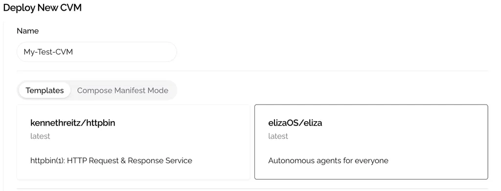
    
3. Choose the compute resources. There are some preset plans available, or you can customize them for more flexibility.
    1. For the template **`kennethreitz/httpbin`**, image.pngwe recommend choosing **TEE Starter**.
    2. For **`elizaOS/eliza`**, we recommend choosing at least **TEE Pro**.
        
        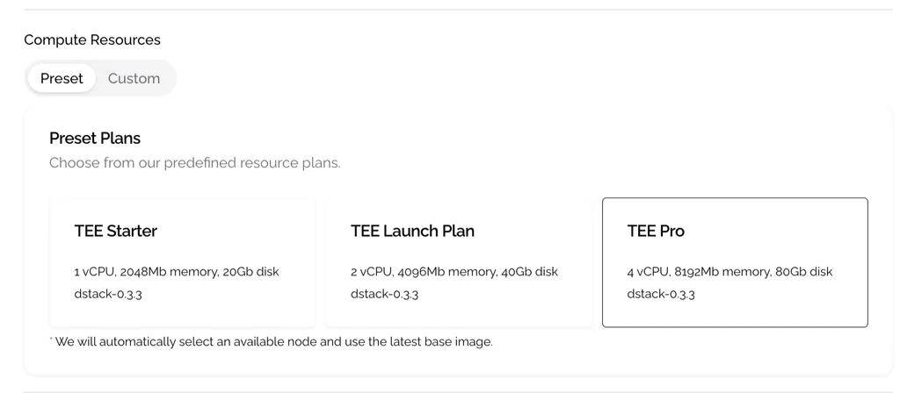
        
4. Click the **Deploy** button to start the deployment process. You will need to wait for a while as the backend sets everything up.
5. After the deployment is complete, navigate through **View Details → Network** to see the endpoint information. You can use these endpoints to access the application if you have service serve on.
    
    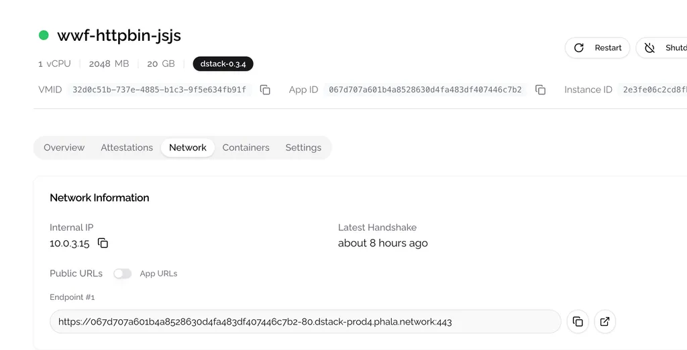
    
    Or switch to **Containers** tab to view container logs. For example, **if you have deployed Eliza, you can see logs in Eliza container like below**:
    
    ```yaml
    [37m ◎ LOGS
    [37m Registering service: [0m
    [37m aws_s3 [0m
    32m ["✓ Service aws_s3 registered successfully"] [0m
    
    [37m ["◎ Room b850bc30-45f8-0041-a00a-83df46d8555d created successfully."]
    [32m ["**✓ User Eliza created successfully**."] [0m
    [32m ["✓ Service browser initialized successfully"] [0m
    Initializing ImageDescriptionService
    ```
    

**Step2 - Verify TEE Proof**

1. Check the default RA Report
    
    We provide a default [Remote Attestation Report](https://sgx101.gitbook.io/sgx101/sgx-bootstrap/attestation#remote-attestation-primitives) (also known as TEE proof), which is displayed in the Worker Dashboard. To view the entire report, click **View Details → Attestation**.
    
    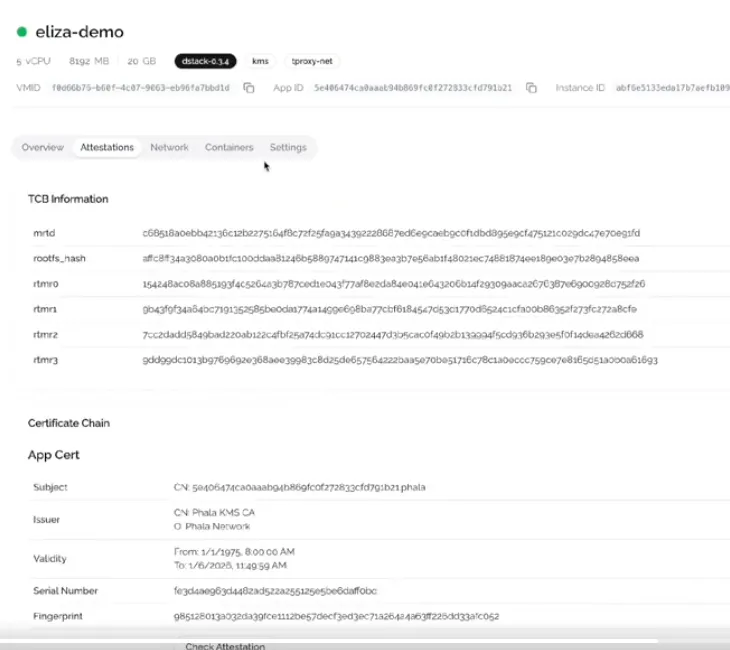
    
2. By clicking the **Check Attestation** button in the certificate chain section, you will be redirected to the [quote explorer](https://proof.t16z.com/), where you can verify the quote. You can share this quote with anyone, as it serves as proof that your program is running inside a genuine TEE.

**Next Steps**

1. **Deploy an Eliza AI Agent in Minutes with the Eliza Template**
2. Create your own application by checking out **Migrate Applications to TEE.**

## 🐝 Migrate Applications to TEE

This section will not cover how to containerize your application with Docker. Instead, we assume you have already done so and have tested it locally to ensure all functionalities work well. Our focus here is to demonstrate how to migrate your application into a TEE, ensuring it remains accessible and providing TEE Proof so you can verify its integrity to anyone interested.

### Expose Service Port

In Docker, you can specify the **HTTP ports** you want to expose by [**configuring port publishing**](https://docs.docker.com/get-started/docker-concepts/running-containers/publishing-ports/#publishing-ports) using the format **HOST_PORT:CONTAINER_PORT**. This configuration forwards requests sent to **HOST_PORT** to the container’s program listening on **CONTAINER_PORT**.

When deploying your Docker program to Phala TEE Cloud, the process remains the same. You should specify the port mapping in the Docker Compose file using the **ports** field, as shown below:

```yaml
services:
  web:
    build: .
    ports:
      - "80:8000"
  db:
    image: postgres
    ports:
      - "8001:5432"
```

After deployment, you will see two public endpoints on the dashboard. These URLs can be used to publicly access the service running in Docker. Behind the scenes, our cloud platform parses the Docker Compose file and automatically configures the network forwarding.

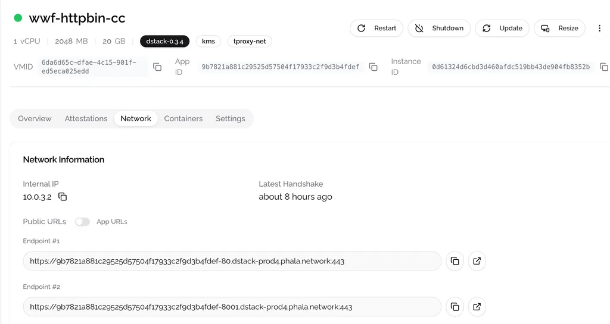

**🎉 Congratulations! You've successfully deployed your application into a TEE. If you're interested in learning more, such as how to prove your application's integrity to others or manage application logs, keep reading.**

### Generate RA Report Inside the Container

The cloud will generate a default RA report for your application when it is bootstrapped. You can view this report on the dashboard under the **Attestation** tab and verify it by clicking the **Check** **Attestation** button.

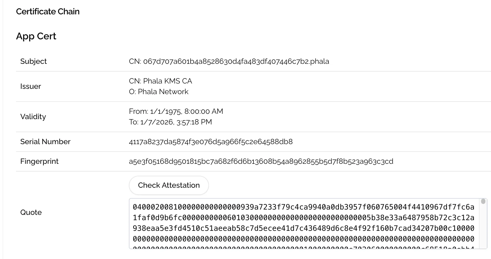

To generate a new RA report, rather than using the default one, which allows you to prove the execution of your code, you first need to mount the Dstack API socket file to the container by configuring **volumes** in the Docker Compose file.

```yaml
services:
  web:
    image: quay.io/jupyter/base-notebook
    volumes:
      - /var/run/tappd.sock:/var/run/tappd.sock
```

In your application, you can generate the RA report using the [Dstack guest SDK](https://github.com/Dstack-TEE/dstack/tree/master/sdk), which supports Python, JS, and Go. The `user-data` field allows you to attach your own data to the RA report. In practice, this is a method to bind the RA report to your application. For example, you can generate a key pair and include the public key. This way, others can verify that the RA report was indeed generated by your program by checking the signature with the public key, after the RA quote itself has been verified.

```python
from dstack_sdk import TappdClient

# Initialize the client
client = TappdClient()

# Get quote for a message
result = client.tdx_quote('user-data')
quote = bytes.fromhex(result.quote)
```

### Access Database

Phala TEE Cloud supports running a database locally or connecting to an external database. There is no difference in how you access a database compared to a general server. To save your data to disk, **you need to [configure volumes](https://docs.docker.com/reference/compose-file/volumes/) in the Docker Compose file** and write data to the correct path, here is an example from Docker website.

```yaml
services:
  backend:
    image: example/database
    volumes:
      - db-data:/etc/data

  backup:
    image: backup-service
    volumes:
      - db-data:/var/lib/backup/data

volumes:
  db-data:
```

### Create Crypto Wallet

You can derive a deterministic key using the [Dstack Guest SDK](https://github.com/Dstack-TEE/dstack/tree/master/sdk) inside Docker. Under the hood, the `TappdClient` derives the key from the application root key.

```python
from dstack_sdk import TappdClient

# Initialize the client
client = TappdClient()

# Derive Key Account by given **derive** **path** and **alt names**
result = await client.derive_key('/', 'alt names')
```

## 🕹 CVM Development

### Deploy with Your Own Docker Compose File

Switch to the **Advanced** tab in the deployment section to edit the Docker Compose file. Deploying with Docker Compose on Phala TEE Cloud is the same as on a general server. You can specify the image name, such as **`image: phalanetwork/eliza:v0.1.6-alpha.4`**, and configure the **PORT** exposing. You can also configure multiple services within the same Docker Compose file, and these Docker containers will run inside the same CVM.

If you want to keep your Docker image private, we support private deployment. Check the **Deploy with Private Docker Image** section for more information.

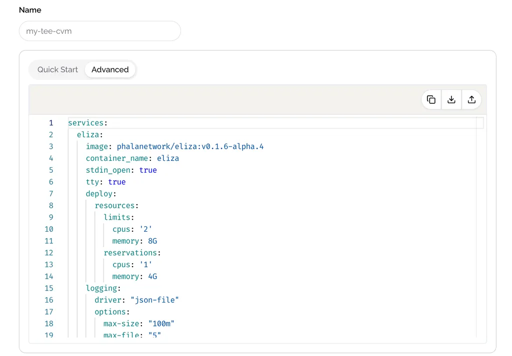

### Set Secure Environment Variables

If your application requires environment variables, **DO NOT** **set them directly in the Docker Compose file**. Instead, set them through the **Encrypted Secrets** section.

1. First you need to declare the environments in Docker compose file like below:
    
    ```python
    services:
      your-service:
    	  environment:
    	      - OPENAI_API_KEY=${OPENAI_API_KEY_IN_ENV}
    	      - TWITTER_API_KEY=${TWITTER_API_KEY_IN_ENV}
    ```
    
    And **DO NOT** set environment with double quotation marks `OPENAI_API_KEY="${OPENAI_API_KEY_IN_ENV}"`
    
2. Then set ENV values in **Encrypted Secrets** section.

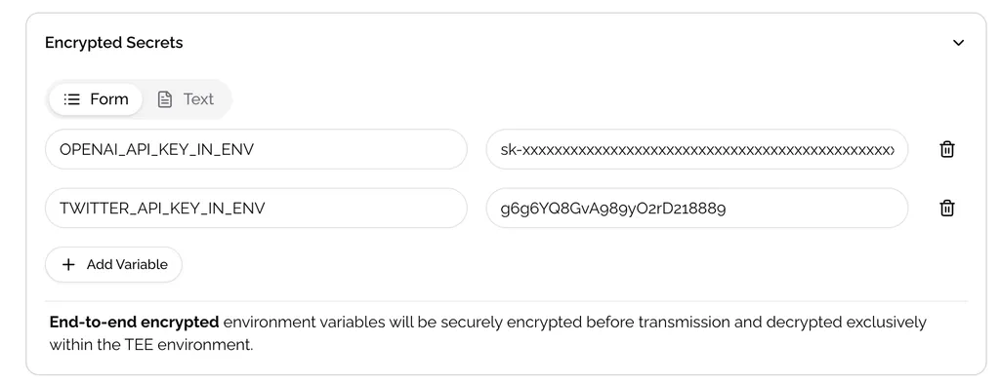

### Deploy with Private Docker Image

Set your personal registry account information in **Advanced Features** → **Custom Docker Registry.** For example, if you have pushed images to Docker hub, you may need to set registry URL as [**https://registry-1.docker.io/**](https://registry-1.docker.io/).


### Access Your Applications

To export your service publicly, you need to configure the PORT exposing when deploying your application. After deployment, click **View Details** in the top-right corner of the CVM instance card and switch to the **Network** tab below. You will see the list of **Endpoint** there. These URLs are generated automatically by parsing the PORT configurations in the Docker Compose file. The format for the URL prefix is `<app id or instance id>-<port>.<server cluster>.phala.network:443`.


### 🔬 Debug your Application

When deploying your application on the Cloud UI, you can choose between two types of CVM base images: `dstack-<version>` and `dstack-dev-<version>`. The dev image allows you to log in to the CVM in the future for debugging purposes. If you opt for a non-dev image, rest assured that no one will have the ability to access your CVM, either physically or remotely.

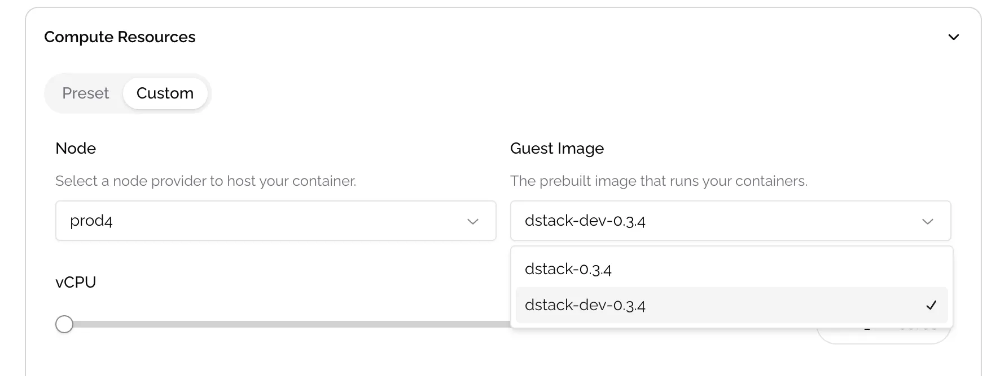

For example, to enable the use of tool **ttypd** for logging into your CVM from a web browser, you need to add a ttypd service to your Docker Compose file as shown below:

```yaml
services:
  alpine-ttypd:
    build: .
    image: hackinglab/alpine-ttyd-bash:3.2
    environment:
    - AUTHOR=e1
    - HL_USER_USERNAME=root
    - HL_USER_PASSWORD=123QWEasd
    ports:
      - 7681:7681
    volumes:
      - /:/host
    network_mode: host
```

You can then view a specific endpoint for the ttypd service by navigating to "**View Details**" → "**Network**." When you open this endpoint in your browser, you will see a terminal interface. The next step is to install the **openssh-client**.

```bash
root@tdx:~ # **apk update && apk add openssh-client**

fetch https://dl-cdn.alpinelinux.org/alpine/v3.13/main/x86_64/APKINDEX.tar.gz
fetch https://dl-cdn.alpinelinux.org/alpine/v3.13/community/x86_64/APKINDEX.tar.gz
v3.13.12-98-g1d183746afa [https://dl-cdn.alpinelinux.org/alpine/v3.13/main]
v3.13.12-94-g0551adbecc [https://dl-cdn.alpinelinux.org/alpine/v3.13/community]
OK: 13906 distinct packages available
(1/3) Installing openssh-keygen (8.4_p1-r4)
(2/3) Installing libedit (20191231.3.1-r1)
(3/3) Installing openssh-client (8.4_p1-r4)
Executing busybox-1.32.1-r9.trigger
OK: 280 MiB in 92 packages
```

You can now log in to the CVM using the command `ssh root@localhost`. As shown below, you can retrieve information about running Docker containers by executing the command `docker ps -a` within the CVM.

```bash
root@tdx:~ # **ssh root@localhost**
The authenticity of host 'localhost (::1)' can't be established.
RSA key fingerprint is SHA256:NKeb2o6243Tj+3dRA9CdQXIwxtXFQFeBN/mJDfetMZk.
Are you sure you want to continue connecting (yes/no/[fingerprint])? yes
Warning: Permanently added 'localhost' (RSA) to the list of known hosts.
Welcome to Dstack!
root@tdx:~# 
root@tdx:~# **docker ps -a**
CONTAINER ID   IMAGE                             COMMAND                  CREATED          STATUS          PORTS                               NAMES
e011968e78d8   hackinglab/alpine-ttyd-bash:3.2   "/init"                  10 minutes ago   Up 10 minutes                                       tapp-alpine-ttypd-1
f7acac54add8   kennethreitz/httpbin:latest       "gunicorn -b 0.0.0.0…"   2 weeks ago      Up 10 minutes   0.0.0.0:80->80/tcp, :::80->80/tcp   tapp-httpbin-1
root@tdx:~# 
```

### 📕 Deployment Cheat Sheet

1. **Build docker image on x86 linux**
    
    Since some developers use Mac ARM, we highly recommend using an x86 machine to build your Docker images before deploying them to our cloud to avoid compatibility issues.
    
    See also:
    
    [Multi-platform](https://docs.docker.com/build/building/multi-platform/)
    
    [How to build x86 (and others!) Docker images on an M1 Mac](https://blog.jaimyn.dev/how-to-build-multi-architecture-docker-images-on-an-m1-mac/)
    
    [Run or build x86_64 Docker image on Apple M1, M2, and M3](https://nesin.io/blog/x86-x86-amd64-docker-mac)
    
2. **Limit the size of your docker logs to save disk usage**
    
    You can config **logging** options for all of your services to limit the size of the docker logs.
    
    ```yaml
    x-common: &common-config
      restart: always
      logging:
        driver: "json-file"
        options:
          max-size: "100m"
          max-file: "5"
    
    services:
      example:
        <<: *common-config
        image: example:0.1.0
        container_name: example
        ports:
          - "8000:8000"
    ```
    

## 💊 CVM Management

### Check Logs

There are two type of logs in Phala TEE cloud. The CVM log and the docker logs.

**CVM log**: By clicking on the **Serial Logs** in the CVM card, you can view the CVM log. The CVM log allows you to see how your application is bootstrapped, such as generating the default RA report and downloading Docker images.

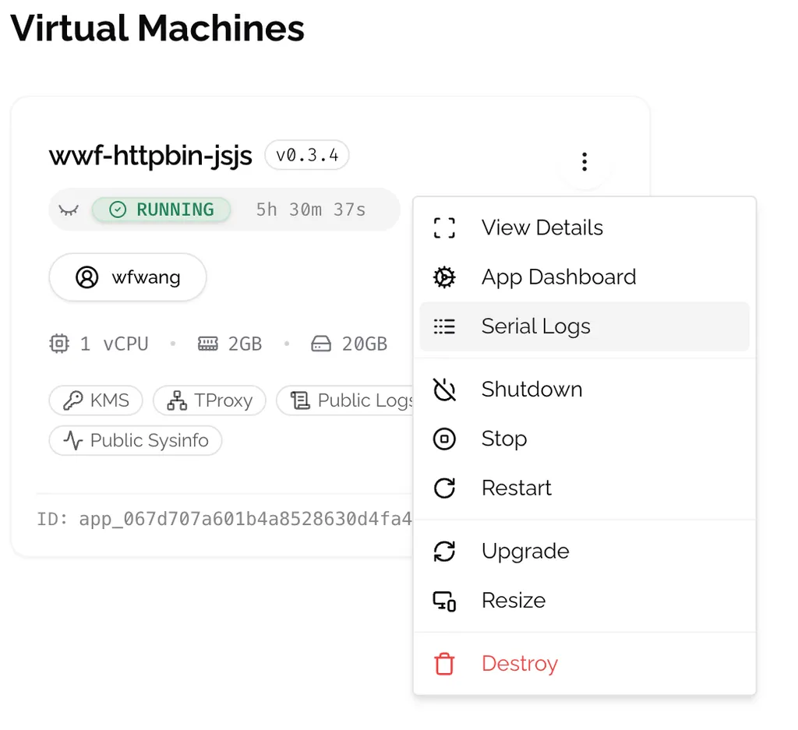

**Docker logs:** This is your application's output log. If you chose to make your Docker logs public during deployment in the **Advanced Features** section, anyone with the log URL can view the logs. To view the log, go to the detailed page and navigate to the **Containers** section.

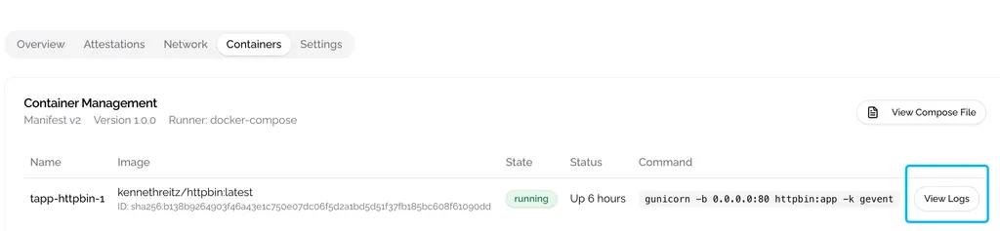

### Set Private Log Viewer

In most cases, you may not want anyone except specific individuals to see the logs. To make your Docker logs private, you can configure a log viewer in the Docker Compose file. For example, you can use the open-source log viewer [Dozzle](https://github.com/amir20/dozzle).

1. Generate user data
    
    On your local machine, generate a Dozzle user authority token using the Dozzle container by running the following command. In this example, we set the username as "Admin," the password as "secret," and the role as "admin.”
    
    ```python
    docker run amir20/dozzle generate --name Admin --email me@email.net --password secret admin | base64 -w 1000
    ```
    
2. Then, setup Dozzle in Docker compose file.
    
    ```python
    services:
      # Viewable logs with dozzle
      setup:
        image: busybox
        restart: "no"
        volumes:
          - dozzle-data:/dozzle-data/
        command: >
          sh -c 'echo "use authority token" | base64 -d > /dozzle-data/users.yml || true'
    
      dozzle:
        container_name: dozzle
        image: amir20/dozzle:latest
        depends_on:
          - setup
        environment:
          - DOZZLE_AUTH_PROVIDER=simple
        volumes:
          - /var/run/docker.sock:/var/run/docker.sock
          - dozzle-data:/data/
        ports:
          - 8080:8080
    ```
    
3. Once the application is running, you will only be able to view the logs using the username and password you set earlier, accessed through the relevant container's public endpoint.

### Monitor Your Application

It's beneficial to have a way to monitor your application, allowing you to check resource usage, network traffic, and more. For instance, by setting up a node-exporter service in your Docker Compose file, you can connect it with Grafana to enable real-time monitoring.

```python
  # Grafana metrics with node_exporter
  services:
	  node_exporter:
	    image: quay.io/prometheus/node-exporter:latest
	    container_name: node_exporter
	    command:
	      - '--path.rootfs=/host'
	    network_mode: host
	    pid: host
	    restart: unless-stopped
	    volumes:
	      - '/:/host:ro,rslave'
	
```

### Upgrade Application

Your application is upgradable even when running inside a TEE. Thanks to the flexible design of the Dstack SDK, the application is not locked into specific hardware. To execute an upgrade, you need to click **Shutdown** on your CVM, then click **Upgrade** to enter the upgrade window.

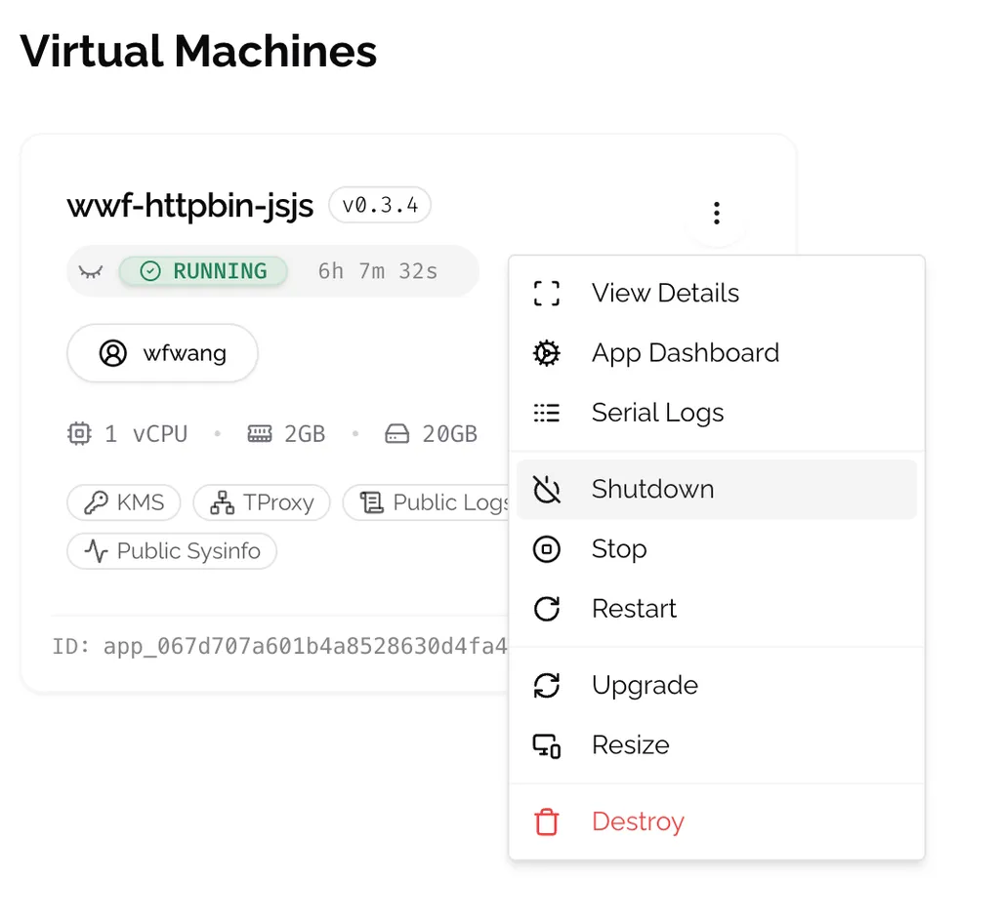

In the upgrade window, you need to set the new Docker Compose file and environment variables for your application. Note that the **new environment variables will completely override the old ones**, so you must also include any variables you do not intend to update. Once you've set everything, click the **Upgrade** button to execute the upgrade. **After the upgrade is complete, you'll need to start the CVM manually**.

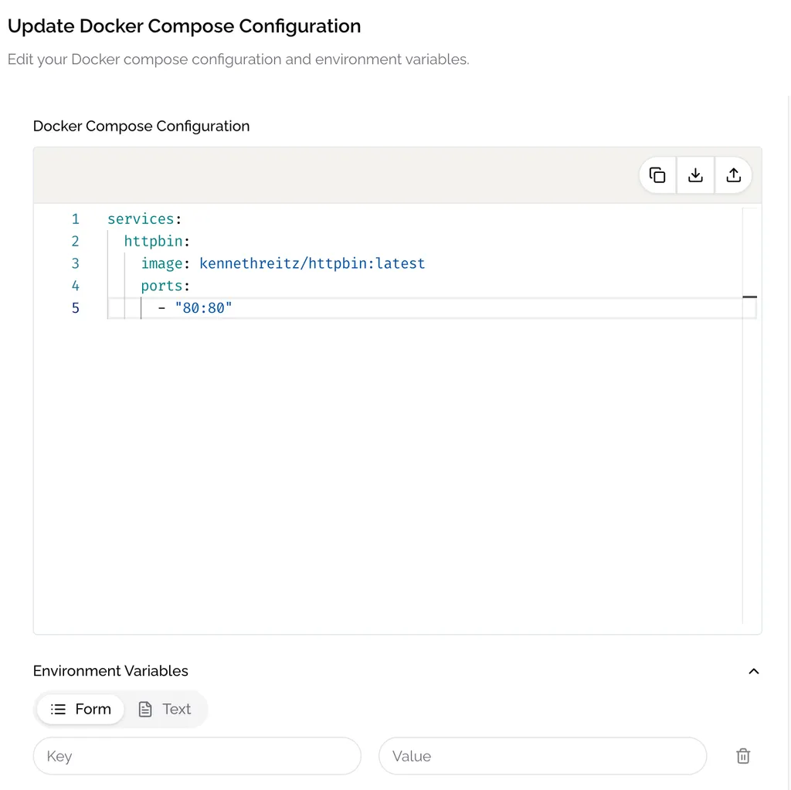

### Resize Resource

Phala TEE Cloud supports adjusting compute resources on demand. To do this, click **Resize** on the CVM card and adjust the resources as needed. Remember, you must shut down the CVM before executing the resize, and then start it again after the changes are saved.

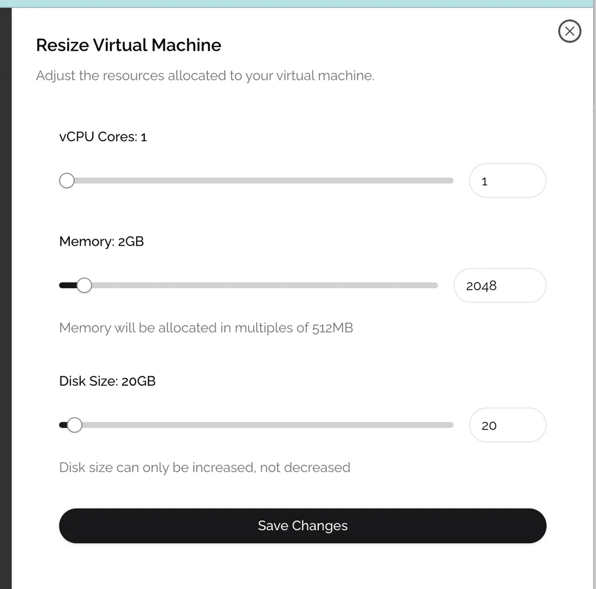

## 🪫 Resources

### Account management

TODO

### Limits

TODO

### Error handling

1. **exec /usr/local/bin/docker-entrypoint.sh: exec format error**
    
    When you see this error in the CVM logs, it indicates that your Docker images are not compatible with the x86 platform. This may happen if you built the image on an ARM or another platform. To resolve this issue, specify the platform by using the argument **`--platform linux/amd64`** when building your Docker images.
    

## 📡 Cloud APIs

If you want to deploy and manage your CVM through scripts, we offer APIs that can support this. Please refer to the [Cloud API documentation](https://cloud-api.phala.network/docs) for more information.

## **💎 Reference Architectures**

### Dstack SDK

The [Dstack SDK](https://github.com/dstack-TEE/dstack) is designed to simplify the process for developers to deploy programs to CVM (Confidential VM) while adhering to security best practices by default. Phala TEE Cloud is a platform built on top of the Dstack SDK, providing developers with a seamless experience for deploying and managing their TEE applications. For more information, please refer to the [Dstack documentation](https://docs.phala.network/dstack/overview).


### Trust Chain

TODO.

### Network Topology

TODO.

## 💰 Pricing

| **Service** | **Specs** | **Hourly Rate** | **6-Month Discount** | **1-Year Discount** |
| --- | --- | --- | --- | --- |
| **Single TEE Computing Unit** | Xeon 5th Gen (1 vCPU, 2GB RAM per unit) | $0.14 | $0.12
**(14% 🔻)** | $0.11
**(21%🔻)** |

For instance, if you deploy an instance using 4 vCPUs and 8GB of RAM, the cost would be $400 per month. [Contact us](https://calendar.app.google/MhCJ6jTNuk3tomcH6) if you are looking for more discount.

## 📬 FAQs

1. **Can the encrypted environment variable be accessed by any other part, including the host OS?**
    
    No, it's encrypted on the client side and sent to the CVM using X25519 encryption scheme. The variables can only be decrypted inside the CVM.
    
2. **Can Docker logs be accessed by any other part, including the host OS?**
    
    Currently, the logs are not end-to-end encrypted. However, you can decide whether to make them public under **Advanced Features → Public Logs** during deployment. If you choose public, anyone with the log URL can view them, and the Log URL can be inferred from your instance ID in the public endpoints. If you choose private, no one can access the logs, and you'll need to configure a log viewer to view them elsewhere.
    
3. **Is application data persistent on the disk?**
    
    Yes, the data you write to the filesystem inside Docker will persist on the disk and be encrypted. Restarting or upgrading will not affect data recovery. To save data on disk, you need to [configure volumes](https://docs.docker.com/reference/compose-file/volumes/) in the Docker Compose file and write data to the correct path.
    
4. **How can others verify that my application is running inside a TEE?**
    
    Once the application is successfully launched, you can prove this by providing the RA Report, which can be exported through an endpoint by your Docker application. The RA Report is linked with the application's runtime information, such as the Docker image hash, the initial arguments passed to the container, and the environment variables.
    

## Glossary

TODO.